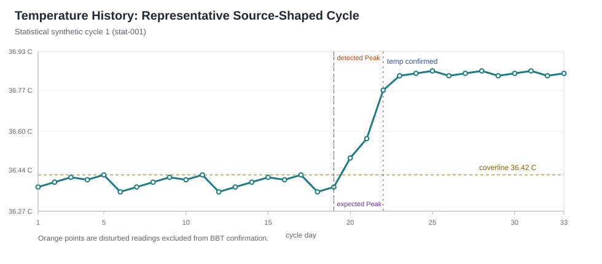
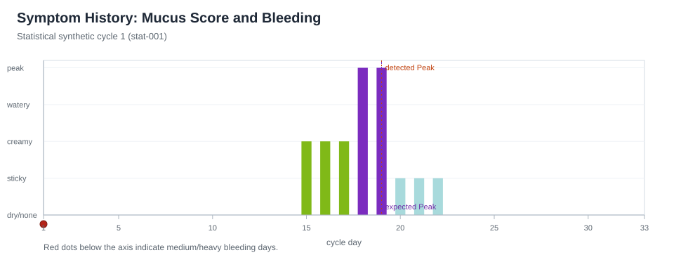
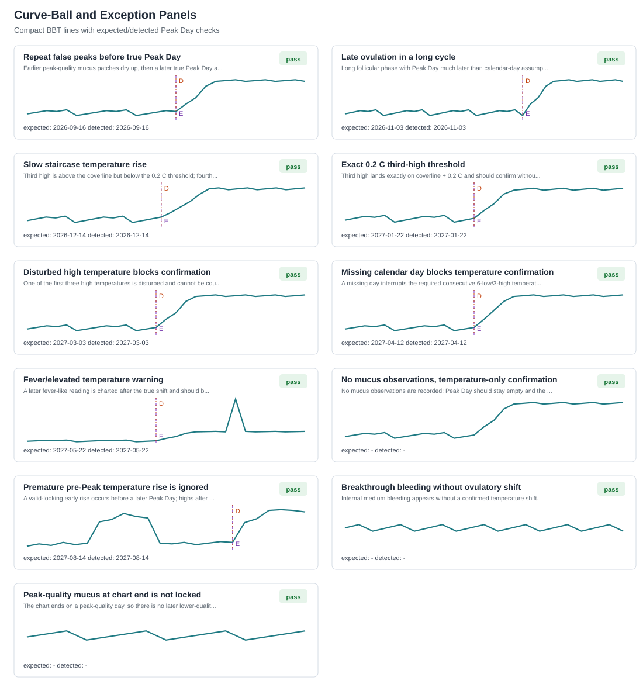
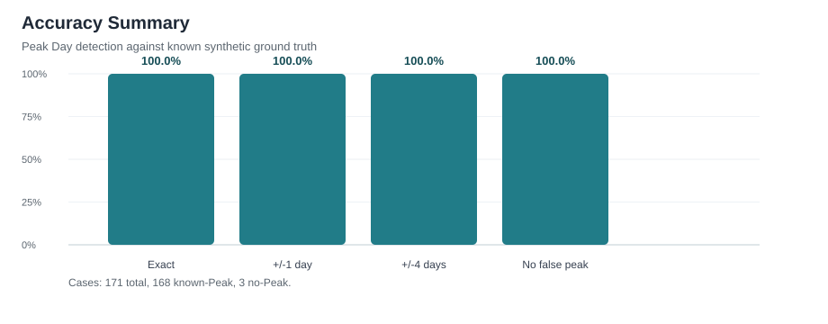

# Peak-Day Accuracy Validation Report

Generated: 2026-05-13T11:38:17

## Executive Summary

The validation harness generated 171 deterministic synthetic charts: 160 source-shaped ovulatory cycles and 11 curve-ball/exception charts. Peak Day detection was exact in 168 of 168 charts with a known Peak Day (100.0%), and every known Peak Day landed within +/-4 days. No no-peak chart produced a false Peak Day.

The generated population stayed close to the cited target ranges: cycle length mean 28.55 days (SD 3.15) and true mucus Peak Day mean cycle day 14.7 (SD 2.63).

This validates the current `stm-v1` rule behavior against known synthetic ground truth. It is not medical certification or a substitute for instruction in a fertility awareness method.

## Figures









## Accuracy Metrics

| Metric | Result |
| --- | ---: |
| Known-Peak charts | 168 |
| Exact Peak Day matches | 168 (100.0%) |
| Within +/-1 day | 168 (100.0%) |
| Within +/-4 days | 168 (100.0%) |
| False negatives on known-Peak charts | 0 |
| No-Peak charts correctly left empty | 3 of 3 |
| False positives on No-Peak charts | 0 |
| Warning expectations hit | 4 of 4 |
| Trace expectations hit | 2 of 2 |
| Exception flag expectations hit | 3 of 3 |

## Curve-Balls and Exceptions

| Case | Expected Peak | Detected Peak | Temp Shift | Expected Signals | Status |
| --- | --- | --- | --- | --- | --- |
| Repeat false peaks before true Peak Day | 2026-09-16 | 2026-09-16 | yes | - | pass |
| Late ovulation in a long cycle | 2026-11-03 | 2026-11-03 | yes | - | pass |
| Slow staircase temperature rise | 2026-12-14 | 2026-12-14 | yes | fourth_day_exception=True | pass |
| Exact 0.2 C third-high threshold | 2027-01-22 | 2027-01-22 | yes | fourth_day_exception=False | pass |
| Disturbed high temperature blocks confirmation | 2027-03-03 | 2027-03-03 | no | - | pass |
| Missing calendar day blocks temperature confirmation | 2027-04-12 | 2027-04-12 | no | - | pass |
| Fever/elevated temperature warning | 2027-05-22 | 2027-05-22 | yes | elevated_temperature | pass |
| No mucus observations, temperature-only confirmation | - | - | yes | bbt_without_mucus, temperature_unclear_mucus_exception, unclear_mucus_exception=True, unclear_mucus_peak | pass |
| Premature pre-Peak temperature rise is ignored | 2027-08-14 | 2027-08-14 | yes | premature_temperature_rise_ignored | pass |
| Breakthrough bleeding without ovulatory shift | - | - | no | possible_anovulatory_bleeding | pass |
| Peak-quality mucus at chart end is not locked | - | - | no | - | pass |

## Bugs and Fixes

No new rule-engine bug was exposed by this validation pass. The suite did re-exercise the existing exact-threshold boundary behavior for the third high temperature, which remains covered.

## Source-Backed Synthetic Design

The synthetic generator uses fixed seeds and known ground truth rather than downloaded patient-level data. This lets the harness score exact Peak Day outcomes while still keeping the simulated chart shapes anchored to published ranges.

- [WHO multicentre ovulation method study](https://www.sciencedirect.com/science/article/pii/S0015028216474789): Cycle length mean 28.5 days, SD 3.18; mucus Peak Day mean day 15, SD 2.6.
- [Fehring 2002 Peak Day study](https://www.sciencedirect.com/science/article/pii/S0010782402003554): Peak Day was within +/-4 days of estimated ovulation in 97.8% of compared cycles.
- [NCBI StatPearls BBT physiology](https://www.ncbi.nlm.nih.gov/books/NBK546686/): Follicular BBT commonly sits around 97.0-98.0 F; luteal rise is about 0.5-1.0 F.
- [Frank-Herrmann/Sensiplan paper](https://www.sensiplan.nl/wp-content/uploads/2025/02/Natural-conception-rates-in-subfertile-couples-following-fertility-awareness-training.pdf): Temperature rise rule: three highs over previous six, with the last high 0.2 C above the previous six.
- [Bailey and Marshall luteal phase summary](https://www.cambridge.org/core/journals/journal-of-biosocial-science/article/abs/relationship-of-the-postovulatory-phase-of-the-menstrual-cycle-to-total-cycle-length/EE433FCF1C8148952B669B01300F09E5): Hyperthermic phase commonly around 10-13 days across shorter to typical cycle lengths.

## Reproducibility

- Script: `scripts/validate_peak_day_accuracy.py`
- Results JSON: `peak-day-validation-2026-05-13-results.json`
- Figure generation notes: `figures/peak-day-validation-2026-05-13/README.md`
- Statistical seed: `20260513`
- Statistical synthetic cycle count: `160`

Regenerate with:

```powershell
.\.venv\Scripts\python.exe scripts\validate_peak_day_accuracy.py
```
